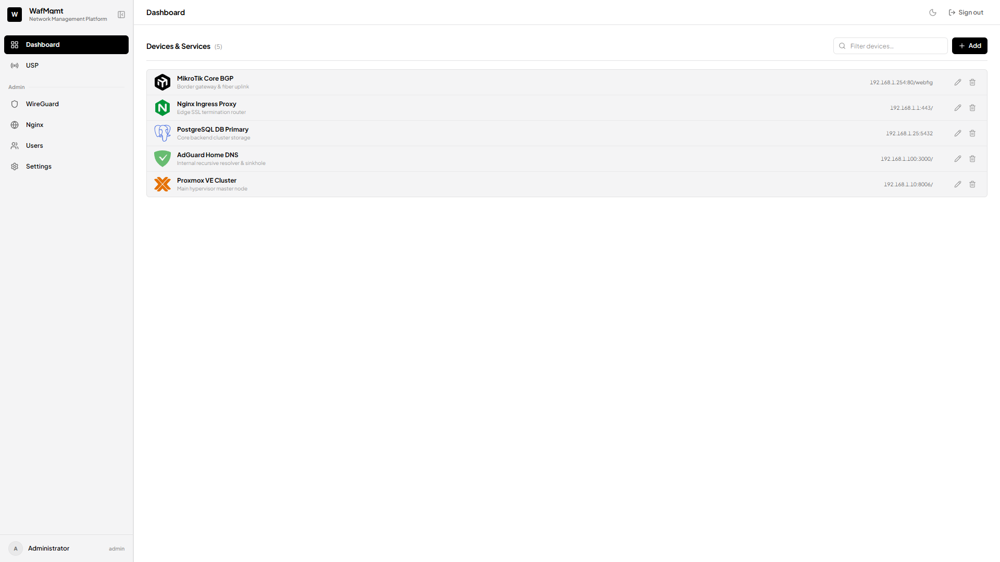
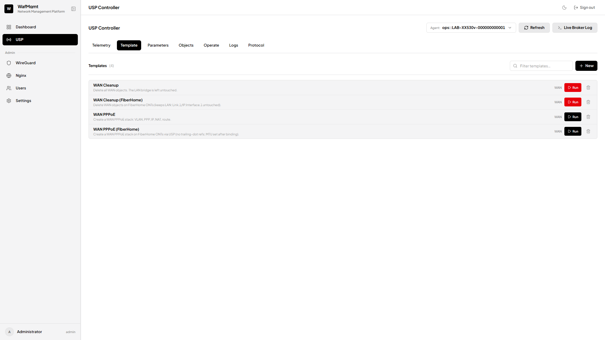
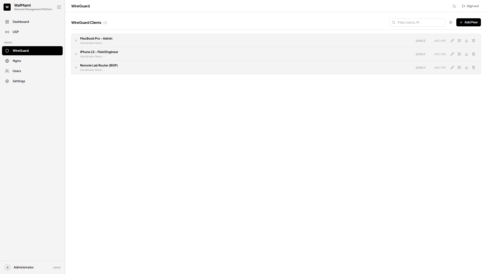
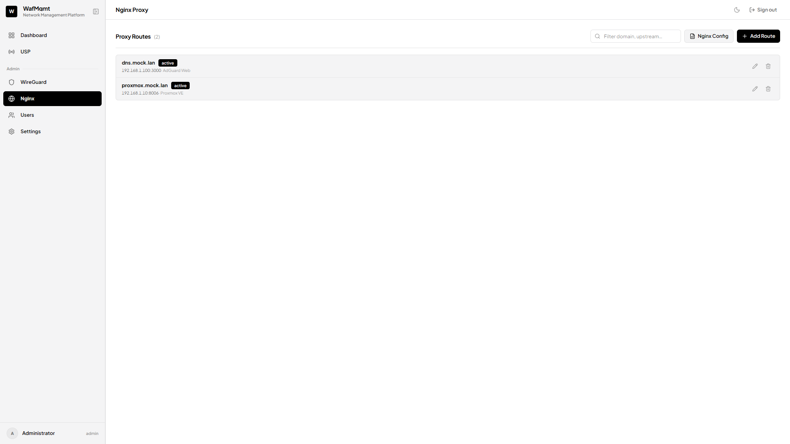

# WafMgmt

Ready-to-run network management platform. Dashboard, USP/TR-369 ONT controller, SSH terminal, WireGuard, nginx routes, users. One box, one process.

## What it does

- **Dashboard** — devices & services, one click to open.
- **USP Controller** — talk to GPON ONTs over TR-369. Query params, add/delete objects, run step templates. WAN PPPoE provision + cleanup flows for TP-Link and FiberHome live here.
- **WireGuard** — make peer configs, QR, download.
- **Nginx** — add vhost routes, reload proxy.
- **Terminal** — SSH in the browser.
- **Users** — roles and per-page permissions.

## Stack

One Bun process (core + usp + terminal). SvelteKit front. SQLite storage. Docker Compose deploy.

## Quick start (Docker)

    cp .env.example .env
    # edit .env — set WAFMGMT_DATA_DIR outside the repo, broker host if split
    docker compose up -d

Open `http://<host>:3001`. First login: user `admin`, blank password — onboarding asks for a new one.

All state lives in `WAFMGMT_DATA_DIR`: SQLite DBs, nginx conf, WireGuard keys, certs. Repo stays clean.

## Run without Docker

    bun install
    bun run start            # backend on :3000

    cd frontend
    bun install
    bun run dev              # UI, proxies /api/* to BACKEND_URL

## Layout

    backend/app         one process, mounts every module
    backend/modules/*   core, usp, terminal (api + internal split)
    backend/kernel      config / http / logger / db / events / auth
    backend/scripts     ops tools: snapshot, backup, arch-lint
    frontend/           SvelteKit UI
    infra/              compose stacks: nginx, broker, wireguard, adguard

## Preview

USP templates — pick agent, run steps, watch result:

WireGuard peers and nginx routes:

